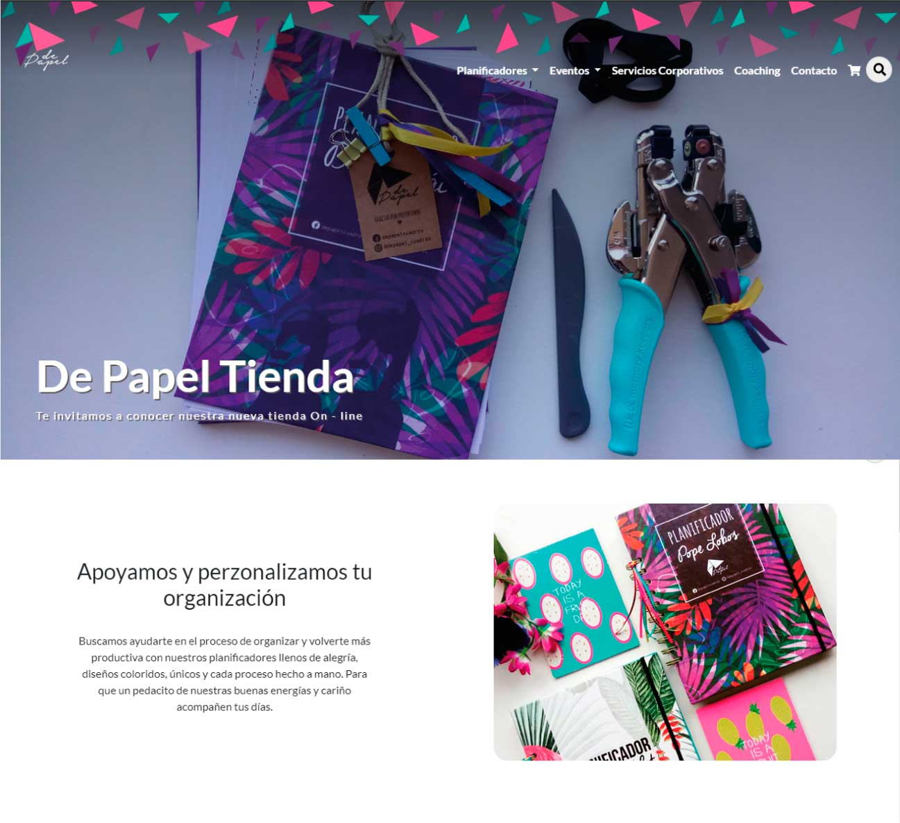

# Proyecto Final

## Template De Papel Tienda
Proyecto final Desafio Latam, 24 Agosto 2018. 
Desarrollado desde 0 para De Papel Tienda. Versión: 1.0
 

 

## Instrucciones
- Assets -> Contiene la versión de web estática
- WP-Depapel -> Contiene todo el Wordpress junto con la carpeta WP-CONTENT
- DB -> Contiene la base de datos. 
- En su servidor, crear nueva base de datos con prefijo dp_
- Importar contenido de la base de datos de la carpeta db
- En la tabla _options cambiar siteurl, y home por 186.64.118.50/~feg7mariana/ 
- Instalar Wordpress, reemplazar toda la carpeta wp-content

 [ De Papel Tienda ](http://186.64.118.50/~feg7mariana/ )
